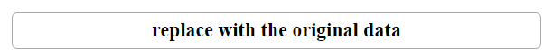
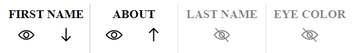
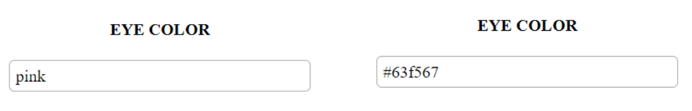
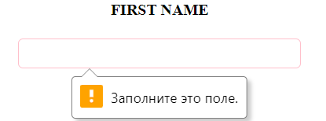

# infotecs

Реализация тестового задания компании "ИнфоТеКС"

## Демо

Работающее приложение размещено на GitHub pages:  [https://likorsi.github.io/infotecs/](https://likorsi.github.io/infotecs/)

## Используемые технологии

- HTML5
- CSS3
- JavaScript

## Особенности реализации

- данные и состояния столбцов (сортировка, скрытие) не теряются при перезагрузке или закрытии окна браузера
- можно вернуть данные к первоначальному виду

- иконки сортировки и скрытия столбцов изменяются в зависимости от состояния

- при перелистывании, сортировке и других действиях не теряются данные в форме - вы всегда видите актуальные данные
- цвета доступны к написанию в любом виде - по имени или коду

- валидация данных

- можно закрыть форму - она откроется снова, когда вы нажмете на строку таблицы

Предварительно проверить код можно с помощью сервисов W3C:

- [CSS](https://jigsaw.w3.org/css-validator/validator?uri=https%3A%2F%2Flikorsi.github.io%2Finfotecs%2F&profile=css3svg&usermedium=all&warning=1&vextwarning=&lang=ru)
- [HTML](https://validator.w3.org/nu/?showsource=yes&showoutline=yes&doc=https%3A%2F%2Flikorsi.github.io%2Finfotecs%2F)